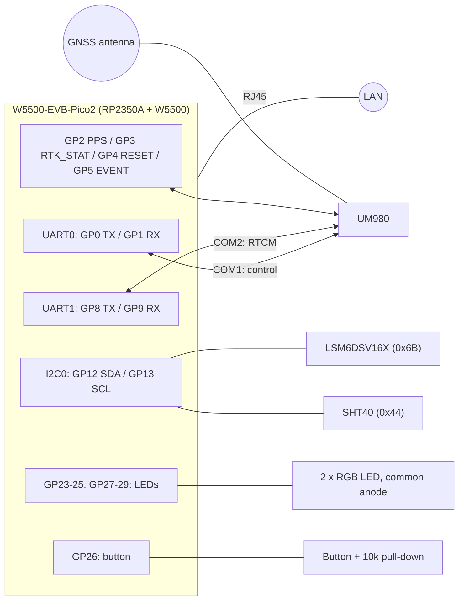

# Hardware

How to build a decipede base station from off-the-shelf boards. The pin
assignments below are those of the firmware (`src/board.h`). The RP2350 +
W5500 part is the **WIZnet W5500-EVB-Pico2** (RP2350A, W5500, 16 MB flash), so
that board can be used as is. See "Using a stock W5500-EVB-Pico2" for the few
pins it doesn't break out.

## Parts

| Part | Role | Notes |
|---|---|---|
| WIZnet W5500-EVB-Pico2 | MCU (RP2350A) + Ethernet (W5500) | Needs the 16 MB flash version: the firmware uses A/B slots plus a 4 MB UM980 firmware staging area at 8 MB. |
| Unicore UM980 module or breakout | Triple-band RTK GNSS receiver | Needs COM1, COM2, PPS, RTK_STAT and RESET_N; EVENT is optional. |
| Triple-band GNSS antenna (L1/L2/L5) | | Fed by the UM980's antenna bias (VCC_RF), as on the usual breakouts. |
| LSM6DSV16X breakout | IMU: vibration and tilt alarm | Optional. I2C address **0x6B** (SA0 high). |
| SHT40 breakout | Board temperature and humidity | Optional. I2C address **0x44** (SHT40-AD1B). |
| 2 × RGB LED, **common anode** | LED1 (Internet/NTRIP), LED2 (GNSS/antenna) | Plus one series resistor per colour (6 in total). |
| Push button + 10 kΩ resistor | BTN_USER (hold > 3 s: reboot) | Active high, with an external pull-down. |
| 3.3 V regulator for the UM980 | | See "Power". |
| WIZnet WIZPoE-P1 | Power over Ethernet | Optional, see "Power over Ethernet". |

The firmware runs without the IMU or the SHT40: their status-page fields stay
empty and the IMU alarm is disabled.

## Wiring overview



## GPIO map

| GPIO | Function | Direction | Connect to |
|---|---|---|---|
| GP0 | UART0 TX: UM980 COM1 (control) | out | UM980 **RXD1** (pin 43) |
| GP1 | UART0 RX: UM980 COM1 (control) | in | UM980 **TXD1** (pin 42) |
| GP2 | GNSS PPS | in | UM980 **PPS** (pin 53) |
| GP3 | GNSS RTK_STAT | in | UM980 **RTK_STAT** (pin 20) |
| GP4 | GNSS reset | open-drain-like (see below) | UM980 **RESET_N** (pin 49) |
| GP5 | GNSS event (unused, kept high-Z) | in | UM980 **EVENT** (pin 51), optional |
| GP8 | UART1 TX: UM980 COM2 (RTCM data) | out | UM980 **RXD2** (pin 26) |
| GP9 | UART1 RX: UM980 COM2 (RTCM data) | in | UM980 **TXD2** (pin 27) |
| GP12 | I2C0 SDA, 400 kHz | in/out | SDA of the LSM6DSV16X and the SHT40 |
| GP13 | I2C0 SCL | out | SCL of the LSM6DSV16X and the SHT40 |
| GP16 | SPI0 MISO | | W5500 (wired on the EVB) |
| GP17 | SPI0 CS | | W5500 (wired on the EVB) |
| GP18 | SPI0 SCK | | W5500 (wired on the EVB) |
| GP19 | SPI0 MOSI | | W5500 (wired on the EVB) |
| GP20 | W5500 RSTn | | W5500 (wired on the EVB) |
| GP21 | W5500 INTn | | W5500 (wired on the EVB). Used for NTP receive timestamps, so it must be connected. |
| GP23 | LED2 blue (PWM) | out | LED2 blue cathode, through a resistor |
| GP24 | LED2 green (PWM) | out | LED2 green cathode, through a resistor |
| GP25 | LED2 red (PWM) | out | LED2 red cathode, through a resistor |
| GP26 | BTN_USER | in | Button to 3V3, plus 10 kΩ to GND |
| GP27 | LED1 green (PWM) | out | LED1 green cathode, through a resistor |
| GP28 | LED1 red (PWM) | out | LED1 red cathode, through a resistor |
| GP29 | LED1 blue (PWM) | out | LED1 blue cathode, through a resistor |

GP23, GP24, GP25 and GP29 are not on the W5500-EVB-Pico2 headers: see
"Using a stock W5500-EVB-Pico2". Free header pins: GP6, GP7, GP10, GP11,
GP14, GP15, GP22.

## UM980

- **Two serial ports, both at 115200 baud, 3.3 V LVTTL:**
  - **COM1** (GP0/GP1) is the control port. The firmware configures the
    receiver at every boot, reads its logs (version, AGC, time, satellites)
    and flashes its firmware through it.
  - **COM2** (GP8/GP9) carries the RTCM correction stream that goes to the
    caster.
  - Cross the lines: RP2350 TX → UM980 RXD, UM980 TXD → RP2350 RX.
- **PPS** (GP2): one pulse per second, rising edge on the second. It is used
  for the UTC clock, the NTP server and the GNSS health watchdog.
- **RTK_STAT** (GP3): high when the receiver has an RTK fixed solution. On a
  base it normally stays low; it is shown on the status page.
- **RESET_N** (GP4):
  - The firmware never drives it high. It leaves the pin high-Z and pulls it
    low only to reset the receiver (watchdog, firmware upgrade).
  - The UM980 has its own pull-up. **Don't add a pull-down,** and no series
    component is needed.
  - At boot the firmware checks that it reads high. If it reads low, every
    reset-based feature is disabled.
- **EVENT** (GP5): not used yet. The firmware keeps the pin high-Z, so it
  may be left unconnected.
- The receiver's saved configuration doesn't matter: the firmware sets the
  ports, messages and base mode it needs at every boot.

## I2C sensors

- One bus on GP12 (SDA) and GP13 (SCL), at 400 kHz.
- The firmware enables the RP2350's internal pull-ups. These are weak, so use
  breakouts that carry their own pull-ups (most do), or add 4.7 kΩ to 3V3 on
  each line.
- **LSM6DSV16X** at 0x6B: the SA0/SDO pin must be high (the default on most
  breakouts).
- **SHT40** at 0x44: the "AD1B" variant. SHT40-BD1B parts answer at 0x45 and
  won't be found.

## LEDs

- **Two common-anode RGB LEDs.** The anode goes to **3V3**; each cathode goes
  to its GPIO through a series resistor.
- The pins are active low and PWM-dimmed at 1 kHz.
- Common-cathode LEDs need a code change (`src/led.c`).
- Size the resistors for **≤ 4 mA per colour**, the RP2350 pads' default
  drive strength. That's about 330 Ω to 1 kΩ, depending on the LED and the
  brightness you want.
- LED colours and their meanings are listed in the README ("LED2" section)
  and shown on the status page.

## Button

- A push button from **3V3 to GP26**, with a **10 kΩ pull-down** from GP26
  to GND. The firmware disables the internal pulls and reads it as active
  high.
- Holding it for more than 3 seconds reboots the station.

## Power

| Consumer | Supply | Typical current |
|---|---|---|
| RP2350 + W5500 (EVB) | the EVB's own 3.3 V regulator, from USB or VSYS | ~150 mA with the link up |
| UM980 | **3.0–3.6 V**, max 50 mV ripple (datasheet) | 145–180 mA, plus the antenna's LNA through VCC_RF |
| Sensors, LEDs | EVB 3V3 | a few mA |

- **Give the UM980 its own 3.3 V regulator,** fed from VBUS/VSYS (5 V). The
  EVB's 3V3 output is meant for light loads, and the UM980 plus the W5500
  would exceed it.
- Most UM980 breakouts already include a regulator: power them from 5 V.
- **Connect the grounds** of the EVB and the UM980.

### Power over Ethernet (optional)

The W5500-EVB-Pico2 can be powered over its Ethernet cable with WIZnet's
**WIZPoE-P1** module. One cable then carries both data and power, which is
handy for a station on a mast or a roof. From the WIZPoE-P1 datasheet
(v1.0.1):

| | |
|---|---|
| Standard | IEEE 802.3af, mode A (endspan) and mode B (midspan), up to 100 m |
| Input | 41–61 V DC from the PoE switch or injector; isolated |
| Output | 5 V (4.75–5.25 V), 0.3–1.5 A; 9 W nominal |
| Minimum load | 150–250 mA |
| Ripple | 100 mV typical, 200 mV max |
| Operating temperature | **−25 °C to +45 °C** |
| Size | 38 × 16 × 13 mm |

- **Power budget:** the whole station needs roughly 0.35–0.45 A at 5 V. That
  is an estimate: EVB plus UM980 plus antenna LNA, with the UM980's
  regulator losses. It's well within the module's 1.5 A and above its
  minimum load, so no dummy load is needed.
- **Wiring:**
  - The module's 5 V output feeds the EVB like any external 5 V supply.
  - The UM980's regulator takes its input from the same 5 V rail.
  - Mount and connect the module as WIZnet documents for the W5500-EVB-Pico2.
    Its inputs go to the RJ45 transformer centre taps (pairs 1/2 and 3/6)
    and to the spare pairs (4/5 and 7/8).
- **With USB connected too** (e.g. for the first flash): don't let the PoE
  5 V and USB VBUS drive each other. Feed the external 5 V into VSYS through
  a Schottky diode, as the Raspberry Pi Pico 2 datasheet recommends for
  external supplies.
- **Temperature limit:** at −25 °C to +45 °C, the PoE module is the most
  temperature-limited part of the station; the UM980 is rated −40 °C to
  +85 °C. In a sun-exposed enclosure, shade and ventilate it, or use an
  industrial-temperature PoE splitter instead. The dashboard's board
  temperature (SHT40) shows what the enclosure actually reaches.

## Using a stock W5500-EVB-Pico2

On the W5500-EVB-Pico2 (as on the Pico 2), four of the LED pins are used on
the board and not broken out:

| GPIO | On-board use |
|---|---|
| GP23 | regulator power-save control |
| GP24 | VBUS sense (voltage divider from USB 5 V) |
| GP25 | the on-board LED |
| GP29 | VSYS/3 measurement (voltage divider) |

Driving GP24 and GP29 as outputs fights their dividers. So on a stock EVB,
move LED2 and LED1's blue channel to free header pins by editing
`src/board.h` before building:

```c
// RGB LEDs, common anode to 3V3 (active low): stock W5500-EVB-Pico2 headers
#define LED1_R_PIN           28
#define LED1_G_PIN           27
#define LED1_B_PIN           14
#define LED2_R_PIN           6
#define LED2_G_PIN           7
#define LED2_B_PIN           10
```

**Why these pins:** the LEDs are PWM-driven. On the RP2350A, GPIO *n* and
GPIO *n*+16 share the same PWM output, so two LED channels must never use
such a pair. For example, GP11 would mirror LED1 green on GP27.

| Pin | 28 | 27 | 14 | 6 | 7 | 10 |
|---|---|---|---|---|---|---|
| PWM slice / channel | 6A | 5B | 7A | 3A | 3B | 5A |

All six outputs are distinct, and none of them is used by another
peripheral. If you pick other pins, the slice is `(gpio >> 1) & 7` and the
channel is A for even and B for odd GPIOs.

## Flashing

See the README ("First install"). The board must be put in BOOTSEL mode once
to install the partition table and the first firmware. Later updates are
over the network.
